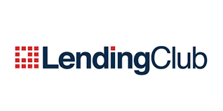
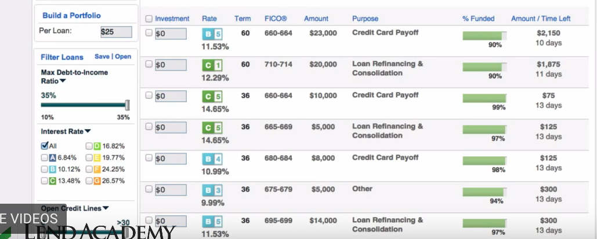

# Classifying loans from Lending Club

## Project aims

"LendingClub enables borrowers to create unsecured personal loans between $1,000 and $40,000. The standard loan period is three years. Investors can search and browse the loan listings on LendingClub website and select loans that they want to invest in based on the information supplied about the borrower, amount of loan, loan grade, and loan purpose. Investors make money from interest. LendingClub makes money by charging borrowers an origination fee and investors a service fee."

The aim of this project is to use loan data provided by the Lending Club to explore deep learning models to see if loans can be accurately classified as "Fully Paid" or "Charged Off".

## Methodology

For this problem, deep learning models were constructed using features that a potential investor would be able to use. This way investors could potentially use these deep learning models to predict which loans were more likely to be paid off versus being defaulted.

## Results

This projected resulted in building several types of MLP (Multilayer Perceptron) models with an accuracy of about 80%.  Further work can be done in the future to improve upon these results such as:
- Use current loans df and model to make predictions
- Further explore features for different feature selections
- Test different initializers and optimizers
- Experiment with more feature engineering
- Look more into imbalanced classe

## Blog

The following link takes you to my blog where I explain more about this project. 

[Deep Learning](https://medium.com/@sabatinochen/deep-learning-b04a42c5a341)

